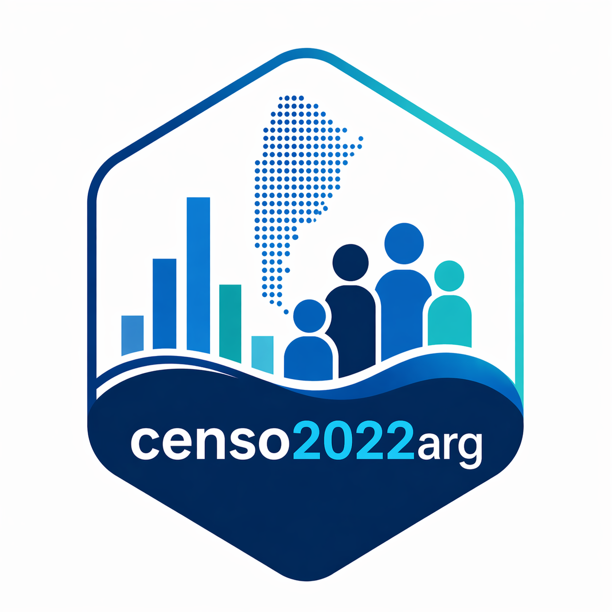

# censo2022arg

<!-- badges: start -->
[](https://cran.r-project.org/package=censo2022arg)
[](https://cran.r-project.org/package=censo2022arg)
[](https://github.com/RodriDuran/censo2022arg/actions/workflows/R-CMD-check.yaml)
[](https://www.gnu.org/licenses/gpl-3.0)
<!-- badges: end -->

<p align="center">
  
</p>

> ⚠️ **Aviso importante (mayo 2026)**
> El INDEC suspendió la distribución de las bases del Censo 2022 para
> descarga local. La versión 1.0.1 disponible en CRAN no puede detectar
> esta situación correctamente. Se recomienda instalar la versión de
> desarrollo (v1.1.0) desde GitHub, que informa la situación
> automáticamente y provee instrucciones para proceder.
> Para consultar cómo acceder a los datos, escriba a
> rodrigo.duran@exa.unsa.edu.ar indicando su afiliación institucional.

**censo2022arg** permite extraer, etiquetar y leer los microdatos del Censo
Nacional de Población, Hogares y Viviendas 2022 de Argentina desde las bases
'REDATAM' distribuidas oficialmente por el
[INDEC](https://www.indec.gob.ar).

## Características principales

- Extracción completa de microdatos provincia por provincia
- Reconstrucción de identificadores jerárquicos (vivienda, hogar, persona)
- Etiquetado automático de variables desde los diccionarios oficiales del INDEC
- Verificación de integridad contra los totales publicados por el INDEC
- Gestión eficiente de memoria mediante subprocesos independientes
- Salida en formato 'Parquet' (default), 'CSV', 'SPSS' o 'SAS'
- Compatible con cualquier base 'RedatamX' (.rxdb)
- Compatible con bases REDATAM anteriores (.dicX): censos 2001, 2010 y bases alternativas


## Instalación

```r
# Desde CRAN (v1.0.1)
install.packages("censo2022arg")

# Versión de desarrollo desde GitHub (v1.1.0, recomendada)
# install.packages("remotes")
remotes::install_github("RodriDuran/censo2022arg")
```

Este paquete se apoya en [`redatamx`](https://github.com/ideasybits/redatamx4r)
de Jaime Salvador para la comunicación con el motor 'REDATAM' desarrollado por
CELADE (CEPAL). Ambas dependencias se instalan automáticamente.

## Uso básico

La función `censo_info()` es el punto de entrada recomendado. Diagnostica el
estado actual del proceso de extracción y análisis, guiando al usuario paso a
paso. Detecta automáticamente qué etapa del flujo ya fue completada y cuál debe
ejecutarse a continuación. Se recomienda ejecutarla después de cada paso.

```r
library(censo2022arg)

# Punto de entrada recomendado: diagnostica el estado e indica el próximo paso
censo_info()

# 1. Configurar el directorio de datos (solo la primera vez)
censo_configurar("/ruta/a/mis/datos/censo2022", persistent = TRUE)

# 2. Verificar el motor de extracción y seguir las instrucciones
censo_verificar_engine()

# 3. Intentar descarga desde el INDEC (~500 MB)
censo_descargar()

# 4. Descomprimir y organizar las bases
#    Si los ZIPs están en una carpeta propia, indicar la ruta:
censo_descomprimir()                           # busca en directorios internos
censo_descomprimir(dir = "D:/Descargas/censo") # carpeta personalizada

# 5. Extraer los microdatos
extraer_redatam()                            # todas las provincias
extraer_redatam(provincias = 66)             # solo Salta (prueba rápida)
extraer_redatam(provincias = c(66, 38, 34)) # varias provincias

# 6. Etiquetar las variables con los diccionarios oficiales
censo_etiquetar()

# Si no tiene los metadatos XLS, puede etiquetar desde las bases:
censo_etiquetar(fuente_meta = "redatam")

# 7. Leer y analizar los datos

# Personas de Salta
personas <- censo_leer(base = "Personas", provincias = 66)

# Hogares de Salta y Jujuy, solo algunas variables
hogares <- censo_leer(
  base       = "Hogares",
  provincias = c(66, 38),
  columnas   = c("NBI_1", "NBI_2", "TIPHOGAR")
)

# Personas mayores de 18 con filtro aplicado antes de cargar en RAM
mayores <- censo_leer(
  base       = "Personas",
  provincias = 66,
  columnas   = c("EDAD", "CONDACT", "IDRADIO"),
  filtro     = quote(EDAD >= 18)
)

# Hogares de todo el país como data.table
hogares_arg <- censo_leer(base = "Hogares", formato = "data.table")

# Extraer microdatos de cualquier base RedatamX genérica
extraer_rxdb(dic_path = "/ruta/a/base.rxdb")

# Extraer microdatos desde cualquier base REDATAM (.dicX o .rxdb)
# Util para censos anteriores (2001, 2010) o bases alternativas
extraer_dic(dic_path = "/ruta/a/base.dicX")                    # todas las entidades
extraer_dic(dic_path = "/ruta/a/base.dicX", entidades = "PERSONA") # solo personas
extraer_dic(dic_path = "/ruta/a/base.dicX", provincias = 66)   # solo Salta
```

## Bases disponibles

El INDEC distribuye tres bases complementarias del Censo 2022:

| Base | Archivo | Contenido |
|------|---------|-----------|
| 'VP' | `cpv2022.rxdb` | Viviendas particulares — variables de persona, hogar y vivienda |
| 'PO' | `cpv2022.rxdb` | Pueblos originarios, afrodescendientes e identidad de género |
| 'VC' | `cpv2022col.rxdb` | Viviendas colectivas |

El pipeline combina 'VP' y 'PO' automáticamente, obteniendo el radio censal de 'VP'
y las variables adicionales de 'PO' (P03, P22, P23, P24, P25, IDETNICA).

## Nota sobre los datos

## Bases alternativas y censos anteriores

La funcion `extraer_dic()` permite trabajar con cualquier base REDATAM en
formato .dicX o .rxdb, independientemente del censo o la fuente. Detecta
automaticamente la jerarquia de entidades y las variables disponibles,
y produce archivos en el mismo formato que `extraer_redatam()`.

Esto incluye los censos nacionales anteriores (2001, 2010) y bases en
formato Redatam7 distribuidas por fuentes alternativas cuando las bases
oficiales del INDEC no estan disponibles.

Este paquete **no distribuye datos del censo**. Los datos deben descargarse
directamente desde el portal oficial del INDEC:
<https://www.indec.gob.ar/indec/web/Institucional-Indec-BasesDeDatos>

> **Nota (mayo 2026):** El INDEC suspendió la distribución de las bases para
> descarga local. Si `censo_descargar()` no puede obtener los archivos,
> escriba a rodrigo.duran@exa.unsa.edu.ar indicando su afiliación
> institucional para consultar cómo proceder.

Los datos del Censo 2022 están protegidos por la Ley N° 17.622 de secreto
estadístico. Su uso está permitido exclusivamente con fines estadísticos
y de investigación.

## Problema conocido en la distribución oficial del INDEC

Las provincias de **Tucumán (cód. 90)** y **Tierra del Fuego (cód. 94)**
presentan conteos incorrectos en las bases distribuidas por el INDEC
(Tucumán devuelve 310.725 personas en lugar de 1.727.337; Tierra del Fuego
devuelve 0). El problema fue confirmado en las tres bases ('VP', 'PO', 'VC') y
**no es un error de este paquete**. Las 22 provincias restantes verifican
con diferencia cero respecto a las tablas de control oficiales.
Reporte enviado a: censo2022@indec.gob.ar

## Citación

Si utilizas este paquete en tu investigación, por favor cítalo:
```
Duran, R. J. (2026). censo2022arg: Extracción y Procesamiento de Microdatos
del Censo Nacional 2022 de Argentina. Versión 1.0.1. R package.
doi:10.32614/CRAN.package.censo2022arg
```

En formato BibTeX:

```bibtex
@software{duran2026censo2022arg,
  author  = {Dur{\'a}n, Rodrigo Javier},
  title   = {{censo2022arg}: Extracci{\'o}n y Procesamiento de
             Microdatos del Censo Nacional 2022 de Argentina},
  year    = {2026},
  version = {1.0.1},
  doi     = {10.32614/CRAN.package.censo2022arg},
  url     = {https://doi.org/10.32614/CRAN.package.censo2022arg}
}
```

## Licencia

GPL (>= 3). Ver [LICENSE](https://www.gnu.org/licenses/gpl-3.0.html) para más detalles.
```
